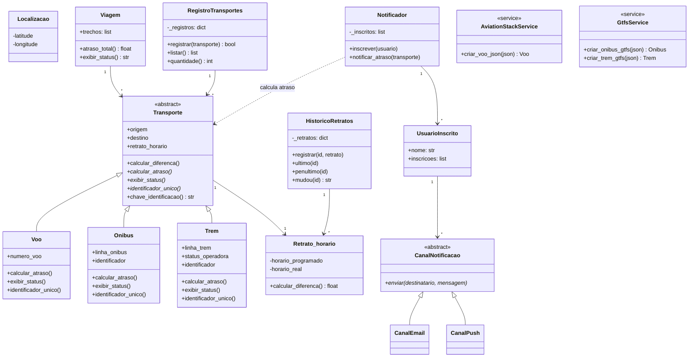

# Painel de Status de Transportes

> Sistema em Python que monitora voos e ônibus em tempo real, calcula atrasos e notifica usuários inscritos.

> Instituto de Computação (IC) — Universidade Federal de Alagoas (UFAL)
> Trabalho prático da disciplina de **Projeto de Software**, lecionada pelo professor **Baldoíno Fonseca**

## Sumário

- [Visão geral](#visão-geral)
- [Conceitos de POO aplicados](#conceitos-de-poo-aplicados)
- [Diagrama de classes (UML)](#diagrama-de-classes-uml)
- [Estrutura do repositório](#estrutura-do-repositório)
- [Requisitos funcionais implementados](#requisitos-funcionais-implementados)
- [Tratamento de erros](#tratamento-de-erros)
- [Autoras](#autoras)

## Visão geral

O projeto implementa um **sistema de monitoramento de meios de transporte** (voos, ônibus e trens) em Python, consumindo APIs externas em tempo real (AviationStack e GTFS Realtime) e convertendo esses dados brutos em objetos de domínio que sabem calcular seu próprio atraso.

**O que o sistema faz:**

- Busca dados reais de voos (AviationStack) e ônibus (feed GTFS Realtime);
- Calcula o atraso de cada transporte comparando horário programado × horário real;
- Mantém um **painel deduplicado**, reconhecendo quando a mesma busca retorna o mesmo transporte;
- Guarda um **histórico de retratos** de horário, permitindo comparar "antes x agora";
- Agrupa múltiplos trechos (voo + ônibus) em uma **viagem única**;
- **Notifica** usuários inscritos (e-mail/push) quando um transporte está atrasado.

## Conceitos de POO aplicados

<table>
<tr><td width="200"><b>Abstração / Herança</b></td><td>

`Transporte` é a classe-base abstrata que padroniza `Voo`, `Onibus` e `Trem` — cada um implementa sua própria regra de atraso.

</td></tr>
<tr><td><b>Polimorfismo</b></td><td>

`main.py` e `Viagem` chamam `exibir_status()` / `calcular_atraso()` igualmente para qualquer modal, sem saber qual subclasse é.

</td></tr>
<tr><td><b>Encapsulamento</b></td><td>

`Localizacao` protege latitude/longitude com atributos privados e valida os limites geográficos na criação do objeto.

</td></tr>
<tr><td><b>Tratamento de exceções</b></td><td>

Praticamente todo acesso a API externa, parsing de JSON/GTFS e conversão de horário é protegido com `try/except` específico, evitando que dado inconsistente derrube o programa.

</td></tr>
</table>

## Diagrama de classes (UML)

<details open>
<summary><b>Ver diagrama de classes interativo</b></summary>


</details>

## Estrutura do repositório

```text
Projeto-de-software/
├── main.py                    # Ponto de entrada — orquestra tudo (menu, cadastro, painel)
├── api_oculta.py               # RF5 — isola e traduz o JSON "cru" das APIs em objetos
├── requeriments.txt            # Dependências do projeto
├── .env.exemplo                 # Modelo do arquivo de variáveis de ambiente
├── .gitignore
│
├── modelos/                     # Regras de negócio / domínio (não sabem de API)
│   ├── transporte.py             # Transporte (base) + Voo, Onibus, Trem
│   ├── retrato_horario.py        # Retrato_horario — programado x real
│   ├── localizacao.py            # Localizacao — encapsula lat/long
│   ├── historico_retratos.py     # Histórico de retratos por transporte
│   ├── registro_transportes.py   # RF9 — painel deduplicado
│   ├── canal_notificacao.py      # RF10 — CanalNotificacao, CanalEmail, CanalPush
│   ├── usuario.py                # UsuarioInscrito
│   └── viagem.py                 # Viagem — agrupa múltiplos trechos
│
└── servicos/                     # Integração com o mundo externo (APIs)
    ├── aviationstack_usuario.py  # Cliente HTTP da API AviationStack (voos)
    ├── gtfs_usuario.py           # Cliente do feed GTFS Realtime (ônibus/trens)
    ├── montador.py               # Converte objetos "API" em objetos "domínio"
    ├── notificador.py            # RF10 — dispara notificações de atraso
    ├── painel.py                 # Monta um painel consolidado (voos + ônibus/trens)
    └── status.py                 # (reservado)
```

## Requisitos funcionais implementados

| RF | Descrição | Onde está |
|---|---|---|
| **RF5** | Isolamento e tratamento da API externa ("API oculta") | [`api_oculta.py`](https://github.com/CarolinaCavalcantee/Projeto-de-software/blob/main/api_oculta.py) |
| **RF9** | Reconhecimento de buscas duplicadas / painel deduplicado | [`modelos/registro_transportes.py`](https://github.com/CarolinaCavalcantee/Projeto-de-software/blob/main/modelos/registro_transportes.py) |
| **RF10** | Inscrição de usuário e notificação de atraso por canal (e-mail/push) | [`modelos/canal_notificacao.py`](https://github.com/CarolinaCavalcantee/Projeto-de-software/blob/main/modelos/canal_notificacao.py), [`modelos/usuario.py`](https://github.com/CarolinaCavalcantee/Projeto-de-software/blob/main/modelos/usuario.py), [`servicos/notificador.py`](https://github.com/CarolinaCavalcantee/Projeto-de-software/blob/main/servicos/notificador.py) |
| — | Validação de coordenadas geográficas (encapsulamento) | [`modelos/localizacao.py`](https://github.com/CarolinaCavalcantee/Projeto-de-software/blob/main/modelos/localizacao.py) |
| — | Histórico de horários e comparação de atraso ao longo do tempo | [`modelos/historico_retratos.py`](https://github.com/CarolinaCavalcantee/Projeto-de-software/blob/main/modelos/historico_retratos.py) |
| — | Viagem com múltiplos trechos (voo + ônibus) | [`modelos/viagem.py`](https://github.com/CarolinaCavalcantee/Projeto-de-software/blob/main/modelos/viagem.py) |

## Tratamento de erros

O sistema foi construído para nunca quebrar por causa de um dado externo inconsistente:

- **Falha de rede / API fora do ar** → `requests.RequestException` capturada em `main.py`, sistema segue sem aquele transporte;
- **JSON ou GTFS em formato inesperado** → `KeyError`/`ValueError`/`IndexError` convertidos em mensagens claras (`api_oculta.py`, `servicos/gtfs_usuario.py`);
- **Horário ausente ou mal formatado** → validado em `Retrato_horario` e no `montador.py`;
- **Coordenadas inválidas** → `Localizacao` recusa a criação do objeto;
- **Chave de API ausente** → `AviationStack` levanta erro amigável pedindo para configurar o `.env`.

## Autoras

**Grupo 5 — Projeto de Software (UFAL)**

- Ana Carolina Cavalcante de Jesus
- Julia Cabral Melo
- Maria Luísa Silva Nunes de Souza
